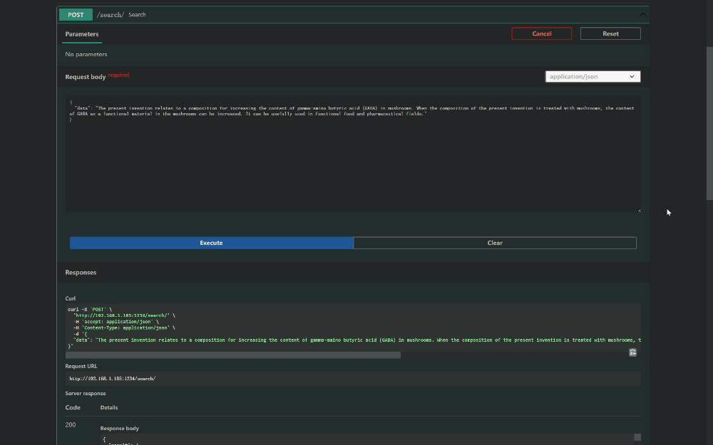

# 基于Paddle进行语义检索



## 🎨 语言

* [English](/README.md)
* [中文](/README-zh.md)

## 📝 描述

这个程序是基于 `Paddle` 框架进行 `语义检索`

有两种模型的类型可供选择：

* `单语言模型` 你可以在每种不同的语言上分别训练单一语言的模型，然后在进行语义检索的时候指定语言。这样的话可能可以得到更高的准确率，但是会被指定语言这一选项限制，只展示所选的语言。
  * 对于中文的模型： `hfl/roberta-wwm-ext-large`
  * 对于英文的模型： `ernie-2.0-large-en`
* `多语言模型` 你可以在不同的语言上只训练一个多语言的模型，然后在进行语义检索的时候就不用指定语言。这种方式其实更适合目前搜索引擎的情况。
  * 对于中英文的模型： `ernie-m-large`

你需要安装 `milvus` 和 `mysql` 来保存向量和其他你需要的信息：

* 保存向量： `milvus` （开源，高度可扩展，速度极快）
* 保存其他信息： `mysql` （当然，你也可以选择你自己喜欢的其他数据库）

## ⚙ 环境

* 使用 `1 * NVIDIA Tesla V100 32G` 进行训练模型（推荐）。请确保已正确安装 CUDA
* 当然你也可以用 CPU 来训练模型

## 🛠 库依赖

* Python 3.9
* paddlepaddle 2.3.1
  * 如果你用CPU进行训练，那么安装 `CPU only` 版本
  * 如果你用GPU进行训练，那么请根据你的GPU和CUDA安装正确的GPU版本
    比如： paddlepaddle-gpu==2.3.1.post112
* paddlenlp 2.3.4

如果你想要部署模型，你还需要安装：

* pymilvus 2.1.0
* pymysql 1.0.2
* fastapi 0.79
* uvicorn 0.18.2

## 📚 文件

* 一共有4个文件夹：
  * `1-preprocess` 把原始的数据预处理成模型能够接受的数据
  * `2-pretrain` 预训练模型，更像是领域上的预训练，但是需要巨大的数据量和硬件
  * `3-finetune` 微调模型，使其适合你的任务
  * `4-deploy` 用来部署训练得到的模型，作为API
* 程序主要使用了 `Jupyter Notebook` 。你也可把 `.ipynb` 转换为 `.py`
* 文件前面的序号是你需要运行的顺序
* 比如，你会先运行 `1-xxx.ipynb` ，然后运行 `2-xxx.ipynb`
* `3-finetune/models` 和 `4-deploy/search_engine/models` 文件夹中的文件都是假文件，真正的文件需要你通过训练得到

```
├─1-preprocess                  # 步骤 1: 预处理
│  └─data                         # 保存原始数据
│      ├─Chinese                    # 保存原始中文文本
│      ├─English                    # 保存原始英文文本
│      └─multilingual               # 保存多语言文本
├─2-pretrain                    # 步骤 2: 预训练
│  └─data                         # 保存预处理后的数据
│      ├─Chinese                    # 保存预处理后的中文文本
│      ├─English                    # 保存预处理后的英文文本
│      └─multilingual               # 保存预处理后的多语言文本
├─3-finetune                    # 步骤 3: 微调
│  ├─data                         # 保存预处理后的数据
│  │  ├─Chinese                     # 保存预处理后的中文文本
│  │  ├─English                     # 保存预处理后的英文文本
│  │  └─multilingual                # 保存预处理后的多语言文本
│  └─models                       # 保存训练后的模型
│      ├─ernie-m-large              # 保存训练后的模型
│      │  └─infer_model               # 保存静态图模型
│      └─roberta-wwm-ext-large      # 保存训练后的模型
│          └─infer_model              # 保存静态图模型
└─4-deploy                      # 步骤 4: 部署
    ├─milvus                      # Milvus 数据库，空文件夹，运行 docker compose 后会自动生成
    ├─mysql                       # MySQL 数据库，空文件夹，运行 docker compose 后会自动生成
    └─search_engine               # 搜索引擎
        ├─0-init_database           # 初始化 Milvus 和 MySQL 数据库，比如创建表、创建集合等
        │  └─data                     # 保存预处理后的数据
        │      ├─Chinese                # 保存预处理后的中文文本
        │      ├─English                # 保存预处理后的英文文本
        │      └─multilingual           # 保存预处理后的多语言文本
        ├─models                    # 保存部署需要用到的模型
        │  ├─Chinese                  # 保存中文单语言模型
        │  ├─English                  # 保存英文单语言模型
        │  └─multilingual             # 保存多语言模型
        └─routers                   # 保存路由
            ├─search                  # 保存搜索需要用到的 Python 脚本
            └─sen_to_vec              # 保存将句子转化为向量需要用到的 Python 脚本
```

## 📖 数据

* data文件夹中的文件只是一些样例数据

* 你需要把你的data转换为一个 `csv` 文件，并且使用 `\t` 来进行分割（实际上，它应该被叫做 `tsv` ）

* 样例数据（多语言文本）:

  | publication_number_sear | title   | abstract_ab                                | ipc_main_stat |
  | ----------------------- | ------- | ------------------------------------------ | ------------- |
  | EN0008                  | title8  | Snap my psyche like a twig                 | H             |
  | CN0001A                 | 标题1   | 橘黄色的日落 吞没在海平线                  | A             |
  | ...                     | ...     | ...                                        | ...           |
  | CN0013A                 | 标题13  | 这座城市有我的思念和喜欢                   | D             |
  | EN0011                  | title11 | Do you ever get a little bit tired of life | F             |

* 你必须确保在文本和标签中没有 `\t` 。 `重要！！！`

* 不需要把数据分为训练数据和测试数据

## 🎯 运行（多语言模型）

可能有些东西需要你自己进行调整。比如：路径

### 步骤 1: 预处理

* 步骤 1（可选）: 运行 `0-take_a_look.ipynb` 查看原始数据的情况
* 步骤 2: 运行 `1-filter_field` 选出你需要的字段
* 步骤 3（可选）: 运行 `2-data_visualization.ipynb` 可视化数据的情况
* 步骤 4（可选）: 运行 `3-data_concat.ipynb` 如果你需要多语言文本的话，需要用这个将单语言的文本进行合并

运行完以上这些步骤后，你可以得到预处理后的数据，把这些数据复制到后续需要用到的文件夹中

### 步骤 2: 预训练

这一步骤需要耗费大量的时间进行预训练。这个文件夹里面没有什么东西，因为我没有时间和 GPU 来重新进行预训练。

如果你想要预训练，你需要自己完成这一步骤。

### 步骤 3: 微调

* 步骤 1: 运行 `1.2-train_multilingual.ipynb` 训练模型，并保存模型和参数
  * 如果你使用单语言模型，请运行 `1.1-train_monolingual.ipynb`
* 步骤 2: 运行 `2.2-to_static_multilingual.ipynb` 获得能够部署的模型
  * 如果你使用单语言模型，请运行 `2.1-to_static_monolingual.ipynb`
* 步骤 3（可选）: 运行 `3.2-infer_multilingual.ipynb` 用来测试推理
  * 如果你使用单语言模型，请运行 `3.1-infer_monolingual.ipynb`

## 📢 部署

得到能够部署的静态图模型后，可以使用 FastAPI 或者其他 API 框架进行部署。

确保你已经正确安装了 `docker` 和 `docker compose`

* Docker 20.10.17
* Docker Compose 2.6.0

cd 到你的部署文件夹，并确保里面有 `docker-compose.yml`

把训练并转换为静态图后的模型复制到 `search_engine/models/Chinese` 或 `search_engine/models/English` 或 `search_engine/models/multilingual` 中，并且让它们像下面这个样子：

* model.get_pooled_embedding.pdiparams
* model.get_pooled_embedding.pdmodel
* sentencepiece.bpe.model (仅对于ernie-m而言)
* special_tokens_map.json
* tokenizer_config.json
* vocab.txt

运行： `docker compose up -d`

* 访问： `localhost:1234/docs` 查看文档
* 访问： `localhost:9000` 进入 Portainer
* 访问： `localhost:19000` 进入 Attu

## 💡 其他

PaddlePaddle 、 PaddleNLP 、 FastAPI 和 Milvus 的文档：

* [PaddlePaddle](https://www.paddlepaddle.org.cn/documentation/docs/zh/guides/index_cn.html)
* [PaddleNLP](https://paddlenlp.readthedocs.io/zh/latest/)
* [FastAPI](https://fastapi.tiangolo.com/zh/)
* [Milvus](https://milvus.io/)
